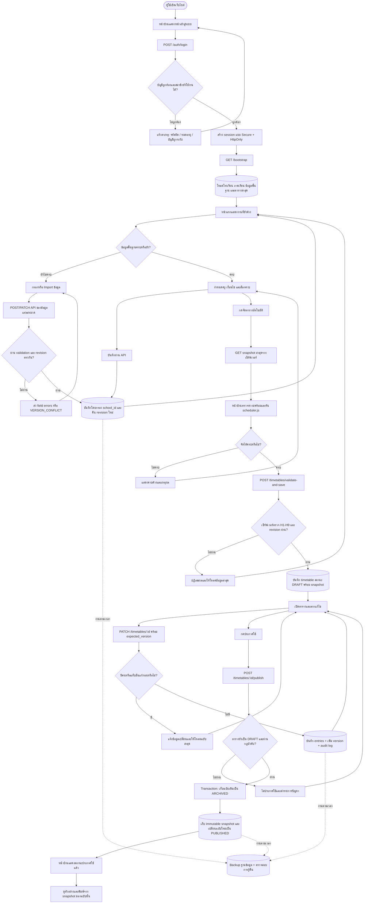

# SchoolTable — Flow chart สำหรับพัฒนาหลังบ้าน

ขอบเขตของระบบ: หนึ่งโรงเรียนมีบัญชีผู้จัดตารางหนึ่งบัญชีและใช้บทบาทเดียว ทุกคำสั่งต้องผูกกับ `school_id` จาก session ฝั่งเซิร์ฟเวอร์ ห้ามรับ `school_id` จากหน้าบ้านแล้วเชื่อถือโดยตรง

## จุดเชื่อมต่อหน้าบ้านกับหลังบ้าน

| การทำงานบนหน้าจอ | API ที่แนะนำ | งานของหลังบ้าน |
|---|---|---|
| เข้าสู่ระบบ | `POST /auth/login`, `POST /auth/logout`, `GET /auth/me` | ตรวจรหัสผ่าน สถานะบัญชี และวันหมดอายุสมาชิก |
| เปิดระบบ | `GET /bootstrap?semester_id=...` | ส่งข้อมูลที่หน้าบ้านต้องใช้ในครั้งเดียว พร้อม `revision` |
| ตั้งค่าโรงเรียนและคาบ | `PATCH /school`, `PUT /period-config` | ตรวจรูปแบบข้อมูลและจำกัดสิทธิ์ตามโรงเรียน |
| ครู วิชา ห้อง ชั้นเรียน หลักสูตร | `/teachers`, `/subjects`, `/rooms`, `/sections`, `/curricula` | CRUD, validation และตรวจรายการที่ถูกอ้างอิงก่อนลบ |
| นำเข้า Excel/CSV | `POST /imports/preview`, `POST /imports/commit` | ตรวจไฟล์ แสดงตัวอย่างก่อนเขียน และบันทึกแบบ transaction |
| จัดครู เงื่อนไข ล็อกคาบ | `/assignments`, `/conditions`, `/locked-slots` | บันทึกข้อมูลและเพิ่ม revision ทุกครั้งที่เปลี่ยน |
| จัดตาราง | `POST /timetables/validate-and-save` | ตรวจ snapshot/revision และกฎบังคับอีกครั้งก่อนเก็บ DRAFT |
| ลากแก้ตาราง | `PATCH /timetables/:id` | รับ `expected_version`; ถ้าไม่ตรงคืน HTTP 409 |
| ประกาศใช้ | `POST /timetables/:id/publish` | ทำ transaction, archive ฉบับเดิม และสร้าง snapshot ที่แก้ย้อนหลังไม่ได้ |
| พิมพ์ | อ่าน `GET /timetables/:id` | ส่ง snapshot ของฉบับนั้น ไม่ผูกกับชื่อครูหรือปีการศึกษาปัจจุบัน |
| สำรอง/กู้คืน | งานอัตโนมัติหลังบ้าน | สำรองออกจากเครื่องหลักและทดลองกู้คืนตามรอบ |

## ตารางข้อมูลหลักที่แนะนำ

ทุกตารางข้อมูลโรงเรียนควรมี `school_id` ยกเว้นบัญชีระบบกลาง

- `users`, `schools`, `subscriptions`, `sessions`
- `semesters`, `period_configs`
- `teachers`, `teacher_availability`, `subjects`, `subject_groups`
- `buildings`, `room_types`, `rooms`
- `grade_levels`, `class_sections`, `curricula`, `curriculum_items`
- `assignments`, `conditions`, `locked_slots`
- `timetables`, `timetable_entries`, `timetable_snapshots`
- `audit_logs`, `import_jobs`

## กติกาที่หลังบ้านต้องรักษา

1. ดึง `school_id` จาก session ทุกครั้ง เพื่อป้องกันโรงเรียนหนึ่งเปิดข้อมูลอีกโรงเรียน
2. การบันทึกต้องคืนผลสำเร็จจริงก่อนหน้าบ้านแสดงคำว่า “บันทึกแล้ว”
3. ใช้ `revision` กับข้อมูลตั้งต้น และ `version` กับตาราง เพื่อป้องกันสองแท็บเขียนทับกัน
4. ตรวจ H1–H9 ที่เซิร์ฟเวอร์ก่อนเก็บหรือประกาศใช้ แม้หน้าบ้านตรวจมาแล้ว
5. ตาราง `PUBLISHED` และ `ARCHIVED` ต้องอ่านจาก snapshot ของตัวเอง เพื่อให้ชื่อครู ห้อง คาบ และปีการศึกษาเดิมไม่เปลี่ยน
6. การประกาศใช้ต้องทำใน transaction เดียว: archive ฉบับเดิม → publish ฉบับใหม่ → เขียน audit log
7. รหัสผ่านต้องเก็บเป็น password hash และ session cookie ต้องเป็น `Secure`, `HttpOnly`, `SameSite`

## การแบ่งความรับผิดชอบ

ตัวจัดตาราง `scheduler.js`, การลากแก้ ตารางบนจอ และตัวอย่างก่อนพิมพ์ยังทำในหน้าบ้านได้ หลังบ้านรับผิดชอบบัญชี สิทธิ์สมาชิก การแยกข้อมูลโรงเรียน การบันทึก การตรวจผลก่อนยอมรับ ประวัติแบบ snapshot และการสำรองข้อมูล

